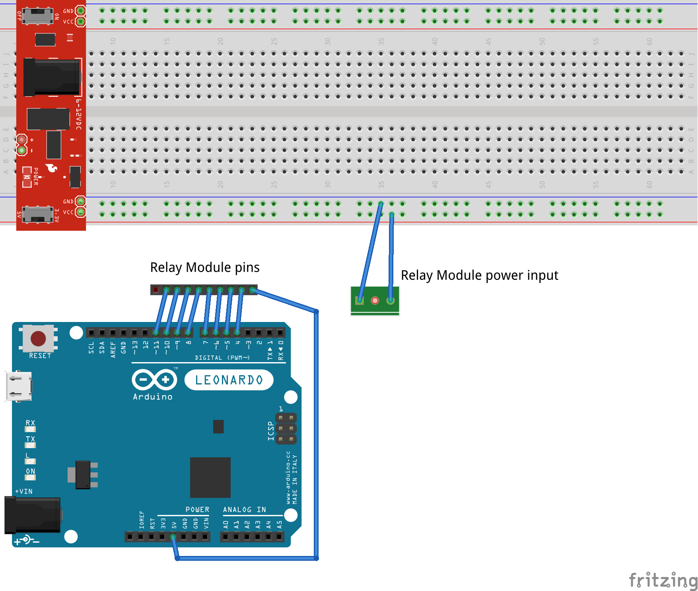

About Luces
===========
Luces ("Lights" in Latin) is a Christmas light show project heavily inspired by
[this one](
https://maker.pro/arduino/projects/christmas-light-show-with-arduino/).

Main differences:

- Free/Libre Open Source Software stack
- Real USB-MIDI device (no need for a virtual MIDI port running on the PC)
- Simplified electronic circuit (8 lines instead of 24)

Geolocation
-----------
You can see the Christmas light show at [Garden Tuttoverde](
https://www.gardentuttoverde.it/) (Seregno, Italy).

geo:45.64677,9.22676?z=18

Here is the [map](https://www.openstreetmap.org/
?mlat=45.64677&mlon=9.22676#map=18/45.64677/9.22676).

Hardware
--------
- A not-too-old PC (see [Ardour system requirements](
https://ardour.org/requirements.html))
- [Arduino Leonardo](https://www.arduino.cc/en/Main/Arduino_BoardLeonardo)
- 1 micro USB cable
- [ELEGOO 8 Channel DC 5V Relay Module with Optocoupler](https://www.elegoo.com/
product/elegoo-8-channel-dc-5v-relay-module-with-optocoupler/)
- 1 5V 1A power supply
- [Behringer UMC202HD](https://www.behringer.com/product.html?modelCode=P0BJZ)
- [Swissonic SA 125](https://www.thomann.de/it/swissonic_sa_125.htm)
- 1 audio cable (XLR male to balanced 6.3 mm jack)
- 2 x [RCF HD 3216T](https://www.rcf.it/it_IT/products/product-detail/hd-3216t/
418924)
- 2 x 0.8 mm² (minimum) copper wires

Software
--------
- OS: Debian GNU/Linux testing (Bullseye)
- Kernel: x86_64 PREEMPT_RT
- Desktop Environment: LXQt
- Arduino IDE (from Snapcraft)
- DAW: Ardour
- JACK Audio Connection Kit

Circuit
-------

Process
-------
1. Connect all hardware
2. Install and configure all software (here is the [MIDI setting](https://
manual.ardour.org/setting-up-your-system/setting-up-midi/midi-on-linux/))
3. Compile and flash the Arduino firmware
4. Set up the DAW files (for tempo mapping see [here](https://www.youtube.com/
watch?v=rrr9lr_Pbkg); MIDI notes must be in the C4-G4 range)
5. Connect Ardour MIDI output to Arduino MIDI input via QjackCtl
6. Enjoy!

Copyright
---------
Copyright © 2020, Plantarium Società Agricola

License
-------
See [LICENSE](LICENSE).

Credits
-------
Thanks, [Mauro Brivio](https://github.com/mbrivio), for your precious tips!

Thanks [Matthias Geier](https://github.com/mgeier), [Fabian Koller](
https://github.com/C0nsultant) and [Ezio Melotti](https://github.com/
ezio-melotti) for your fundamental help in Python programming.
